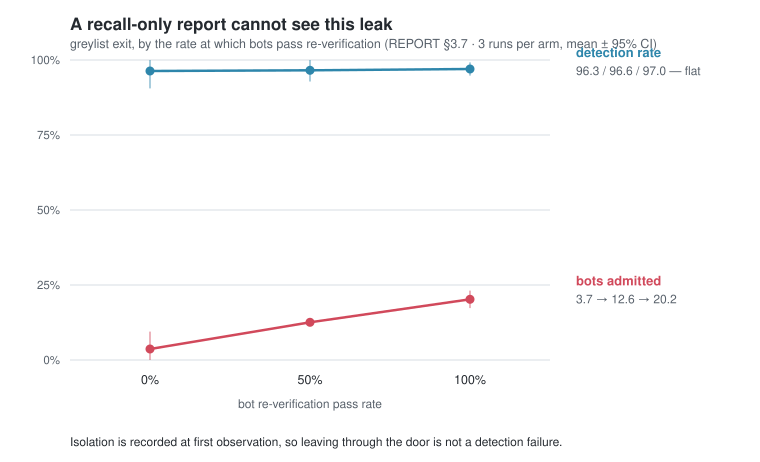

# ShardGate

**A sharded virtual waiting room that uses each shard as a statistical sample to detect,
isolate, and block bots — and a record of measuring that under load, and of falsifying its
own conclusions twice.**

The queue is the artifact. The measurement log is the point.

Every headline number below came from running the entire stack (Redis · Kafka · PostgreSQL ·
5 services · k6 load generator), N times per arm, reported as mean ± 95% CI. Several of the
most useful findings are negative: a knob that was proposed, measured, and **rejected**; a
defect that no test could catch **because nothing failed**; an explanation that was written
down, then disproved by a targeted experiment — and then the disproof itself turned out to
be an artifact of the measuring tool.

---

## What the measurements found

Read top to bottom. Each row exists because the row above it turned out to be wrong or
incomplete.

| # | Finding | Numbers |
|---|---|---|
| 1 | Detection stalled at **half**. Not because the detector was weak — **it was racing admission and losing.** A bot that gets in stops sending heartbeats, so it can never be scored. | recall **53.8%**; isolation median lagged bot admission by 30–77s |
| 2 | Measure the ceiling before tuning anything. With admission disabled, the same detector catches **everything**. So the 53.8% was *entirely* lost in the race. | **100.0 ± 0.0%** recall, 0.0% FPR; isolation median 139.8s, **P90 202.3s** |
| 3 | The randomized-order window was **free**: it removes the bots' head-start advantage at no cost. | recall **+13pp**, bot admission −13pp, seats unchanged |
| 4 | Delaying admission globally also works — but it pays for detection with **throughput**. It is rationing, not defense. | +13pp more recall, **seats −38%** (369.8 → 287.5) |
| 5 | A **per-user** observation gate beats the global one on four axes at once, with non-overlapping CIs — because it defers seats instead of destroying them (the check sits *before* the budget decrement). | recall 96.2 vs 91.7 · bot 3.9 vs 8.3 · human 51.4 vs 37.5 · seats **371.2 vs 287.5**. Cost: first admission 30.4s later |
| 6 | Gate length is not a taste. It must exceed the **isolation median**, or the door opens before the verdict lands. | 90s gate (< median 132–142s) → 85.4% · 200s gate → **96.2%** |
| 7 | Giving greylist an exit lets false positives out — **and bots too.** Recall does not move at all, so a recall-only report cannot see this leak. | recall 96.3 / 96.6 / 97.0 (identical) while bot admission **3.7 → 12.6 → 20.2%** |
| 8 | That leak was mostly the door **bypassing the observation gate**: the gate measured time-since-*entry*, and a returning user had already satisfied it. Separating the *observation clock* from the entry clock closed it. | door channel **exactly 0** in 6 runs; bot admission 20.2 → **2.2%**; humans admitted 309 → **331** |
| 9 | The door's cost did not disappear — it **moved**. Restored users hold their rank while re-observing, so seats stop being used at all. | seats 370.0 / 356.3 / 337.7 — **−0.058 seats per restore**; 86% of the lost seats were humans' |
| 10 | Priced the stated goal ("make bots cost more than they gain") and **missed it by 1,400×**. This layer reduces the *number* of successful bots; it does not make them expensive. | **$0.036** per admitted bot, PoW = 0.2% of it. Parity with one CAPTCHA solve needs 33 bits = **265s** for a real user |
| 11 | Built a false-positive persona — a corporate golden image behind office NAT, flagged for *who it is*, not what it does. The door ran end-to-end for them, and **not one of them got in.** The mechanism that stops bots stops them identically. | **100 of 100** injected personas flagged, in all three runs; the other **600 humans: zero**. 300 re-verifications, **0 admissions through the door** |
| 12 | The obvious fix ("shorten re-observation after a return") was **measured and rejected before being built.** Re-flag time is a monotone function of the score, and the score already ranks the false positives *above* the bots. | re-flag median: false positives **11s**, bots **10s**. At every window W, bots pass at ≥ the human rate |
| 13 | Synthesized the attack the relative signals invite: flood the shard with accounts in your bot's own behavior band, and the comparison baseline moves. Robust statistics help — **until the 50% breakdown point, then they are worse.** | with mean/σ, the target's signal falls **0.780 → 0.320** as contamination goes 12% → 50%. At 36%: median/MAD **0.616** vs mean/σ 0.420. At 50%: median/MAD **0.176** vs mean/σ 0.320 |
| 14 | Switched the estimator to median/MAD and re-ran **under load**, in both populations. The defense holds — and because the only thing changed was the baseline, this **retroactively identifies the mechanism** behind row 11's collapse, which the synthetic model could measure the direction of but not the size. | with false positives present: recall **85.3 → 98.1%**, FPR unchanged at 14.3%, seats +28.6. Without them: recall and FPR unchanged, isolation **33s faster**. This is now the default |



Row 7 in one picture, and the most counter-intuitive result here: the three arms differ only
in how often bots pass re-verification. Detection is **identical** across all three, because
isolation is recorded at first observation — what changes is how many of the isolated ones
get back out. The figure is generated from the result JSONs
(`loadtest/tools/figure.py`), not screenshotted, so it cannot drift from the table.

Full write-up with methodology, confidence intervals, and the arguments against each
conclusion: **[docs/REPORT.md](docs/REPORT.md)**.

---

## The system

The premise: when 1M people arrive in the same second, a *single* global queue is both a
Redis hot key and a bad place to look for bots — a bot farm dissolves into a large
population. Split users into shards of 500–2,000 and each shard becomes a cheap statistical
sample where a farm stands out.

```
Client → CDN/WAF → Gate (PoW challenge, JWT) → Queue (Redis ZSET, per shard)
                                                  ↓
                       Admission (per-shard budget) → Shop (1 purchase per person)
Client → Telemetry → Kafka (partition key = shard_id) → Bot Scorer → quarantine ladder
```

Design decisions that carry the most weight:

- **Shard assignment is unpredictable.** `HMAC(event_salt, token_id) mod N`, salt secret
  until open, so a farm cannot aim at a shard — this is what bounds the contamination in
  finding 13.
- **Every queue state transition is a single atomic Lua script.** Cluster hash tags
  (`{event:shard}`) keep one shard's keys in one slot so this holds in cluster mode.
- **Detection and admission are decoupled.** If the scorer dies, the queue keeps moving.
  A test enforces it.
- **No single signal can block anyone.** The ladder is observe → greylist → hold → block,
  and blocking additionally requires ≥2 independent signals. Config, not comments.
- **Isolation is reversible.** Greylist has an exit (re-challenge), holds preserve rank,
  and a user's score keeps updating while isolated — because an action that stops
  observation makes isolation a terminus.

Stack: Go · Redis 8 (ZSET + Lua) · Kafka 4.2 (KRaft) · PostgreSQL 18 · k6 · Prometheus +
Grafana · docker compose. ~15k lines of Go, 11 Lua scripts, 25 test files (unit +
testcontainers integration).

Throughput on an M4 Pro with a single Docker Redis: **100k enqueues in 2.87s** (34,904/s),
123 µs/op.

---

## Nine defects that only appeared when the real stack ran

Unit and integration tests passed through all of them. They are listed in full in
[docs/ROADMAP.md](docs/ROADMAP.md); the pattern is what matters:

- An unauthenticated Redis published on `0.0.0.0` **was compromised within minutes** (cron
  injection). Every port is now bound to `127.0.0.1` and `make check-exposure` blocks
  regressions in CI.
- The randomized-order window had **never once been enabled** — the feature existed, its
  tests passed, the config key existed, and the deployment simply never passed a value.
- The scorer joined a Kafka topic that did not exist yet, was assigned **0 partitions**, and
  went `Stable`. Nothing failed. Detection was entirely off, and the run still produced a
  plausible-looking "0.0% detection, 0.0% false positives" table.
- Three measurement runs used a setting that docker-compose silently ignored, because
  compose's `environment:` block is a **whitelist**. The arm changed; nothing failed.

The last three share a shape: **nothing fails, and a believable table comes out.** The
harness now has five guards against exactly that, including a conservation identity
(`admissions = door + unflagged`, residual must be 0) whose entire job is to catch a
failure whose nature nobody anticipated.

The tenth was not found by running anything: **this repository had no git history until
Phase 9.** A CI workflow was written, nine regression guards were added, and 27 measurement
arms were run — with zero commits. Same shape as the others (nothing fails, no signal
appears), except no automated check can catch it, because it is a process defect rather than
a tooling one. The history is not reconstructed: inventing phase-shaped commits out of
final-state files would produce exactly the kind of plausible-looking artifact this project
spent 1,500 lines learning to distrust.

---

## Run it

```bash
make dev          # whole stack via docker compose
                  # waiting room  http://localhost:8088
                  # grafana       http://localhost:3000
make test         # unit tests
make test-int     # integration tests (testcontainers; needs Docker)
make loadtest     # k6 mixed scenario, prints the metrics report
make check-exposure   # refuses 0.0.0.0 port publishing
```

Reproducing a measurement arm (each rep rebuilds the stack from scratch, so results are not
contaminated by the previous run):

```bash
ARM=obs200 REPS=4 \
  SG_ADMIT_RATE_PER_MIN=75 SG_ADMIT_INTERVAL=4s SG_ADMIT_MIN_DWELL=200s \
  SG_LOTTERY_WINDOW=90s SG_SHARD_COUNT=2 SG_SHARD_SIZE=600 \
  SG_TOTAL=1000 SG_BOT_RATIO=0.3 SG_PATIENCE=300 \
  bash loadtest/tools/sweep.sh

python3 loadtest/tools/report.py summary loadtest/results/obs200   # mean ± 95% CI
```

Each rep writes a manifest next to its result (commit, arm config, seed), and the sweep
aborts rather than emit a table if the stack did not come up in the arm's configuration.

---

## Repository map

| Path | |
|---|---|
| `cmd/{gate,queue,admission,scorer,shop}` | service entry points — wiring only, no logic |
| `internal/shard` | HMAC shard assignment, dynamic growth |
| `internal/queue` | Redis ZSET operations, Lua loader |
| `internal/challenge` | PoW issue/verify (difficulty is injected, never decided here) |
| `internal/botscore` | shard statistics, scoring, the quarantine ladder |
| `internal/admission` | per-shard budget, backpressure, circuit breaker |
| `scripts/lua/` | **single source of truth for every queue state transition** |
| `loadtest/k6/` | participant behavior models: humans, three bot types, a false-positive persona |
| `loadtest/tools/` | sweep harness, CI-style report with confidence intervals, cost model |
| `web/` | waiting-room demo page (solves the PoW in a real worker) |

## Documents

| | | |
|---|---|---|
| [docs/DESIGN.md](docs/DESIGN.md) | architecture, scoring policy, API, and an honest limits section | [한국어](docs/DESIGN.ko.md) |
| [docs/REPORT.md](docs/REPORT.md) | the measurement report — every table, every counter-argument | [한국어](docs/REPORT.ko.md) |
| [docs/ROADMAP.md](docs/ROADMAP.md) | phase-by-phase log, including what was tried and abandoned | [한국어](docs/ROADMAP.ko.md) |
| [CLAUDE.md](CLAUDE.md) | working agreement for AI-assisted development: invariants, and rules written as *"don't do this, here is what happened when we did"* | [한국어](CLAUDE.ko.md) |

> The Korean files are the originals — these documents were written in Korean and the English
> versions are translations. Where the two disagree, `*.ko.md` is authoritative.

---

## 한국어 요약

**샤딩 기반 가상 대기열 + 샤드를 통계 표본으로 쓰는 매크로 자동 격리·차단 시스템.**
그런데 이 저장소의 요점은 대기열 구현이 아니라 **측정 기록**입니다 — 실제 스택을 팔마다
여러 번 돌려 평균 ± 95% 신뢰구간으로 보고했고, 그 과정에서 **자기 결론을 두 번 반증**했습니다.

핵심 서사(위 표와 같은 순서):

1. 탐지율이 절반에서 멈춘 이유는 탐지기의 한계가 아니라 **입장과의 경주에서 진 것**이다
   (admit 을 끄고 재면 100.0 ± 0.0%).
2. 추첨 구간은 **공짜로** 13pp 를 준다. 시각 게이트는 13pp 를 더 주지만 **자리를 38% 줄여서**
   준다 — 방어가 아니라 배급이다.
3. 사용자 단위 관찰 게이트는 네 축에서 동시에 이긴다. 예산 차감 **앞**에서 판단해 자리를
   없애지 않고 미루기 때문이다. 길이는 **격리 중앙값보다 길어야** 한다.
4. greylist 에 낸 문은 봇도 내보낸다. **탐지율은 전혀 움직이지 않아** 탐지율만 보는 표에는
   이 누수가 보이지 않는다 — 격리와 격리 유지는 다른 지표다.
5. 그 누수의 대부분은 문이 **관찰 게이트를 우회**한 몫이었다. 관찰 시계를 진입 시각과
   분리하자 문 채널이 6회 실행 모두 정확히 0 이 됐다.
6. **문의 대가는 사라지지 않고 자리 총량으로 옮겨갔다.** 복귀한 사람은 순번을 지킨 채
   관찰을 다시 채우므로 복귀 1건당 0.058자리가 아무에게도 가지 않고, 사라진 자리의
   **86% 가 사람 몫**이다.
7. §1.4 가 선언한 "봇의 비용 > 정상 사용자의 가치"는 이 층에서 **1,400배 차이로 미달**이다.
   이 층이 하는 일은 성공하는 봇의 **수**를 줄이는 것이다.
8. 오탐 페르소나를 만들자 문이 실제로 돌았고 **아무도 입장하지 못했다**. 봇을 막은 기전이
   오탐으로 걸린 사람을 똑같이 막는다. 부수적으로 **탐지율이 12pp 내려갔다** —
   오탐과 미탐이 같은 방향으로 움직인다.
9. 그 해법으로 떠오른 "복귀 후 재관찰 길이" 손잡이는 **만들기 전에 재서 기각**했다 —
   재플래그 시간은 점수의 단조 변환이고, 그 점수가 오탐 집단을 봇보다 위에 세운다.
10. 상대 신호가 초대하는 **기준선 오염 공격**을 합성해 크기를 쟀다. 강건 통계는 붕괴점
    (오염 50%)까지만 방어하고 그 뒤로는 오히려 나쁘다.
11. 그 방어를 **부하로 검증했다.** 오탐 집단이 있는 인구에서 탐지율 85.3 → 98.1%,
    오탐율은 그대로. 없는 인구에서는 탐지율·오탐율 그대로에 격리만 33초 빨라졌다.
    바꾼 것이 기준선 추정 하나뿐이므로, **8번에서 오탐 집단이 탐지율을 12pp 끌어내린
    기전이 여기서 소급 확정된다** — 합성으로는 방향만 알 수 있었고 크기는 부하에서만
    나왔다. 기본값을 켰다.

실제 스택을 돌려야만 나온 결함 9건, 그 아홉과 같은 모양이지만 **어떤 자동 검사로도 잡히지
않는** 열 번째(Phase 9 까지 git 저장소가 없었다), 그리고 "아무것도 실패하지 않는 고장"을
잡기 위해 넣은 검사들은 [docs/ROADMAP.md](docs/ROADMAP.md) 에 있습니다.
