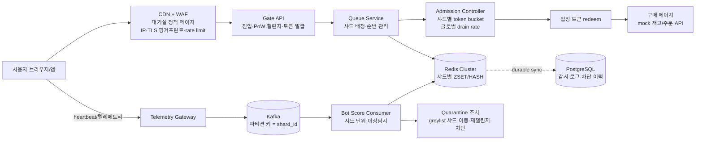
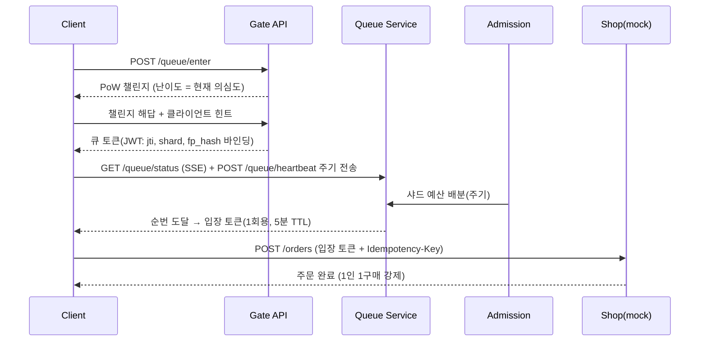

# ShardGate — 샤딩 기반 가상 대기열 + 매크로 자동 차단 시스템 설계서

*[English](DESIGN.md) · **한국어** — 이 문서가 원문이고 영어판은 번역이다.*

> 콘서트 티켓팅 / 한정판 드랍처럼 순간적으로 수십만~수백만 명이 몰리는 이벤트에서,
> 사용자를 **작은 샤드(micro-shard) 단위 대기열**로 나누고, **샤드를 통계적 표본 집단으로 활용해
> 매크로/봇을 자동 탐지·격리·차단**하는 시스템의 설계 문서.
> 포트폴리오 프로젝트이지만 실제 대용량 트래픽 환경을 전제로 설계한다.

---

## 1. 문제 정의와 목표

### 1.1 문제
- 티켓 오픈 순간 트래픽이 평시 대비 수백~수천 배 폭증 → 원 서버(재고/결제)가 직접 노출되면 즉시 다운.
- 매크로(봇)는 사람보다 빠르게 진입·반복 요청하여 정상 사용자의 기회를 빼앗음.
- 전통적 해법인 "단일 글로벌 대기열"은 (a) Redis 핫키 병목, (b) 봇 탐지 시 전체 모수 대상 연산이 비싸다는 한계가 있음.

### 1.2 핵심 질문에 대한 답
**"그룹으로 잘게 나눠서, 그 안에서 매크로를 자동 차단할 수 있는가?" → 가능하다.**
오히려 잘게 나누는 것이 봇 차단에 유리하다:

| 관점 | 단일 대기열 | 마이크로 샤드 대기열 |
|---|---|---|
| 이상탐지 비용 | 전체 모수(수십만) 대상 → 비쌈 | 샤드당 수백~수천 명 → 저렴, 스트림 처리 가능 |
| 탐지 민감도 | 큰 모수에 봇이 희석됨 | 작은 표본에서 봇 클러스터가 통계적으로 도드라짐 |
| 오탐 대응 | 전체 정책 변경 필요 | 해당 샤드만 재검증(blast radius 최소화) |
| 인프라 | ZSET 1개 핫키 | 샤드별 키 분산 → Redis Cluster 슬롯에 자연 분산 |

### 1.3 목표 (Goals)
1. 100만 동시 진입을 버티는 가상 대기실(virtual waiting room).
2. 사용자를 500~2,000명 규모의 샤드로 분할, 샤드 단위 순번 관리 및 입장률 제어.
3. 다층(edge → 챌린지 → 토큰 → 행동 → 샤드 통계) 봇 방어. 탐지 시 **즉시 차단이 아닌 단계적 격리**(오탐 보호).
4. 탐지율 / 오탐율(FPR) / 처리량 / 지연 지표를 측정 가능한 형태로 구현 (포트폴리오 증빙).

### 1.4 비목표 (Non-Goals)
- 결제, 좌석 선택, 재고 시스템 자체의 구현 (mock으로 대체).
- 봇의 "완전" 차단. 목표는 봇의 비용을 정상 사용자의 가치 이상으로 끌어올리는 것.
  (레지덴셜 프록시 + 사람이 직접 조작하는 대행은 기술만으로 못 막는다 — §12 한계 참고)

  > **측정해 보니 이 문장은 대기열 층의 목표로는 맞지 않는다(REPORT §3.9).**
  > 입장에 성공한 봇 1마리가 무는 값은 $0.036 이고 그중 PoW 몫은 0.2% 다. 티켓
  > 프리미엄을 $50 으로 잡으면 격차가 1,400배이고, PoW 난이도를 설정 상한까지
  > 올려도 대행 단가의 1.4% 라 메워지지 않는다 — 같은 값이 되는 33비트는 정상
  > 사용자에게 265초짜리 계산이다.
  >
  > 이 층이 실제로 하는 일은 **성공하는 봇의 수를 줄이는 것**이다(관찰·격리·사다리).
  > 실제로 문 하나를 막자 성공한 봇이 60.7 → 6.7마리로 줄었는데, 같은 변화에서
  > **1마리당 비용은 오히려 내려갔다** — 비싼 경로를 막으면 남는 것은 싼 경로이기
  > 때문이다. 비용으로 막는 일은 §12-1 의 계정·결제 층의 몫이고, 이 문장은 그
  > 층을 전제로 읽어야 한다.

---

## 2. 전체 아키텍처



### 구성 요소 요약
| 컴포넌트 | 역할 | 상태 저장 |
|---|---|---|
| CDN + WAF | 대기실 페이지 정적 서빙(원서버 보호), L1 봇 필터 | 없음 |
| Gate API | 진입 요청 수락, PoW 챌린지, 서명된 큐 토큰(JWT) 발급 | Redis |
| Queue Service | 샤드 배정, 순번 부여, 위치 조회(SSE/폴링) | Redis |
| Admission Controller | 샤드별 입장 허용량 배분, 글로벌 admit rate 제어 | Redis |
| Telemetry Gateway | 클라이언트 heartbeat·행동 이벤트 수집 → Kafka | Kafka |
| Bot Score Consumer | 샤드 단위 통계 이상탐지, 점수화, 조치 트리거 | Redis + PG |
| Mock Shop | 입장 토큰 검증 후 1인 1구매 (idempotency) | PG |

---

## 3. 대기열 & 샤딩 설계

### 3.1 샤드 배정 — 예측 불가능해야 한다
```
shard_id = HMAC-SHA256(event_salt, queue_token_id) mod N
```
- `event_salt`는 이벤트마다 새로 생성하고 **오픈 전까지 비공개**. → 봇이 특정 샤드를 노려 몰려가거나, 샤드 배정을 미리 계산하는 것을 차단.
- `N`(샤드 수) = ⌈예상 동시 진입자 / 목표 샤드 크기(기본 1,000)⌉. 진입자가 예상을 초과하면 신규 진입자용 샤드를 동적으로 추가(기존 샤드는 재배치하지 않음 — 순번 안정성).

### 3.2 공정성 모델 — FIFO의 함정
오픈 직후 수 초 안에 수십만 명이 몰리는 상황에서 순수 FIFO는 "네트워크가 빠른 자(=봇 포함)"에게 유리하다. 하이브리드를 기본값으로 한다:

1. **추첨 구간**: 오픈 후 첫 T분(기본 2분) 내 진입자는 도착 순서와 무관하게 샤드 내 랜덤 순번.
2. **FIFO 구간**: T분 이후 진입자는 추첨 구간 뒤에 도착순으로 붙는다.

이 모델은 봇의 "0.1초 선점" 이점을 구조적으로 제거하는 것 자체가 1차 봇 무력화 장치다.

### 3.3 Redis 자료구조 (샤드별로 분산)

#### 논리 스키마
| 키 | 타입 | 내용 |
|---|---|---|
| `queue:{event}:{shard}` | ZSET | member=token_id, score=순번 |
| `hold:{event}:{shard}` | ZSET | 입장 보류(score 70~89) 사용자. **원 순번을 그대로 보존**해 해제 시 손해 없이 복귀 |
| `seq:{event}:{shard}` | STRING | FIFO 구간의 단조 증가 순번 카운터 |
| `user:{event}:{token_id}` | HASH | 상태(waiting\|admitted\|greylist\|held\|blocked\|evicted), shard, score, fp_hash, ip_prefix, joined_at, last_seen, orig_shard, orig_rank |
| `admitted:{event}` | STRING | 누적 입장 카운터 |
| `budget:{event}:{shard}` | STRING | 샤드별 남은 입장 예산 (token bucket) |
| `shards:{event}` | SET | 활성 샤드 목록. 동적 샤드 확장(§3.1)을 추적 |
| `entry:{event}:{jti}` | STRING | 1회용 입장 토큰. TTL 5분, redeem 시 소각 |
| `challenge:{event}:{nonce}` | STRING | 1회용 PoW 챌린지. TTL 내 1회만 검증 |
| `score:{event}:{shard}` | HASH | token_id → 봇 점수 |
| `stats:{event}:{shard}` | HASH | 샤드 단위 통계 누적 (스코어러 전용) |
| `suspicion:{event}:{subject}` | STRING | fp_hash/ip_prefix 별 의심도 — 적응형 PoW 난이도 입력 |
| `idem:{event}:{key}` | STRING | 멱등키 |

`queue`/`user`/`admitted`/`budget` 4종이 원안이고, 나머지는 구현하며 추가된 것이다.
이 표에 없는 키를 임의로 만들지 않는다.

#### 물리 키 — Cluster 해시태그
논리 키를 그대로 쓰면 한 샤드의 키들이 서로 다른 해시 슬롯에 흩어져,
"상태 전이는 단일 Lua 원자 실행"이라는 규칙이 **Cluster 모드에서 성립하지 않는다**
(Lua 는 한 슬롯의 키만 만질 수 있다). 그래서 `{event}:{shard}` 를 해시태그로 묶는다:

```
queue:{evt1:s0042}          hold:{evt1:s0042}       seq:{evt1:s0042}
budget:{evt1:s0042}         score:{evt1:s0042}      stats:{evt1:s0042}
user:{evt1:s0042}:tok_abc   entry:{evt1:s0042}:jti_xyz
```

- 한 샤드에 속한 모든 키 → 같은 슬롯 → Lua 원자성 성립.
- 서로 다른 샤드 → 서로 다른 태그 → 슬롯에 자연 분산, 단일 핫키 없음.
- 이벤트 전역 키는 `admitted:{evt1}`, `shards:{evt1}`.
- `challenge`/`idem` 은 nonce/키를 태그에 포함해(`challenge:{evt1:<nonce>}`) 분산시킨다. 단일 키 연산만 한다.

#### greylist 샤드는 원 샤드의 슬롯을 함께 쓴다

§4 의 greylist 이동은 "원 대기열에서 빼고 / greylist 대기열에 넣고 / 상태를 바꾸는"
세 동작이다. 두 대기열이 다른 슬롯에 있으면 Cluster 에서 한 Lua 로 묶을 수 없어,
이동이 중간 상태가 보이는 2단계 작업이 된다. 그래서 greylist 샤드 `g0042` 는
원 샤드 `s0042` 의 태그를 그대로 쓰고 샤드 이름만 접미사로 붙인다:

```
queue:{evt1:s0042}          hold:{evt1:s0042}          ← 원 샤드
queue:{evt1:s0042}:g0042    hold:{evt1:s0042}:g0042    ← greylist (같은 슬롯)
user:{evt1:s0042}:tok_abc                              ← 두 경우 모두 같은 키
```

사용자 해시의 키가 양쪽에서 동일하므로 **사용자 상태는 이동 자체를 겪지 않는다.**
움직이는 것은 ZSET 멤버 하나뿐이고, 그 전체가 한 슬롯 안이라 원자적이다.

키 문자열 조립은 `internal/keys` 한 곳에서만 한다.

- **모든 상태 전이는 Lua 스크립트로 원자 실행** (배정+순번, 검증+admit 차감 등). race condition 원천 차단.
- 샤드 키가 서로 다르므로 Redis Cluster 해시 슬롯에 자연 분산 → 단일 핫키 문제 해소.

### 3.4 입장 제어 (drain)
- 글로벌 admit rate(예: 3,000명/분)를 Admission Controller가 샤드별 예산으로 주기 배분.
  - 기본: 샤드 잔여 인원 비례 배분. **greylist 샤드에는 예산을 배분하지 않는다(0).**
    원안은 "가중치 하향"이었는데, 그건 greylist 에서 직접 입장하는 경로가 있다는
    전제에서만 말이 된다. §4 의 사다리에 그런 경로는 없다 — 벗어나는 유일한 길은
    재챌린지 통과로 **원 샤드에 복귀**하는 것이고, 복귀하는 순간 원 샤드 예산을 쓴다.
    greylist 에 예산을 내려보내면 아무도 쓸 수 없는 자리가 매 주기 사라진다.
- 사용자의 표시 순번 = 샤드 내 순번과 drain 속도로 추정한 대기 시간. 5초 주기 폴링 또는 SSE.

#### admit 개시 시점 — 추첨 구간과의 관계

§12-7 이 특정한 기전은 "탐지가 입장과 경주해서 진다"는 것이다. 조치 파이프라인은
누적 점수로 움직이므로 격리에 70~80초가 걸리는데, 그 사이에도 admit 은 계속 나가고
**먼저 입장한 봇은 격리될 기회 자체를 얻지 못한다.**

그래서 admit 개시를 추첨 구간 종료까지 미루는 선택지를 둔다(`ADMIT_AFTER_LOTTERY`).
추첨 구간은 §3.2 에서 이미 "도착 순서에 이점을 주지 않는" 구간으로 정의돼 있으므로,
그 구간 동안 입장을 닫아도 순번의 공정성은 달라지지 않는다. 바뀌는 것은 두 가지다:

- 탐지가 점수를 세울 시간을 추첨 구간만큼 확보한다.
- 전체 대기 시간이 그만큼 늘고, 같은 시간 안에 나가는 자리 수가 줄어든다.

공정성이 아니라 **처리량과 탐지율의 맞교환**이므로 기본값은 꺼 둔다.
켜려면 `EVENT_OPEN_AT` 이 반드시 있어야 한다 — 없으면 추첨 구간 자체가 없어
게이트가 조용히 무효가 되므로, 설정 검증이 기동을 거부한다.
측정 결과는 docs/REPORT.md §3.4.

#### 사용자 단위 최소 관찰 게이트 — `ADMIT_MIN_DWELL` / `ADMIT_MIN_BEATS`

위 게이트는 **이벤트 시각 하나로 전원을 막는다.** 그래서 두 가지가 남는다.
막힌 주기의 자리는 그대로 사라지고(예산을 안 내려보내므로), 게이트가 열린 뒤에
도착한 사람은 거의 관찰되지 않은 채 통과한다. 관찰이 필요한 것은 이벤트가 아니라
**개인**이므로, 재는 기준도 개인의 진입 시각이어야 한다.

```
입장 조건 = (순번 < 예산) AND (now - observe_from ≥ MIN_DWELL) AND (hb_count - hb_base ≥ MIN_BEATS)
```

기준점은 진입 시각이 아니라 **관찰 시계**(`observe_from`)다. 둘은 보통 같지만
재챌린지 복귀 이후로 갈라진다 — 자세한 이유는 아래 "복귀는 관찰 시계를 되감는다".

"아직 볼 만큼 못 봤다"는 무죄가 아니라 **판정 불가**다. 점수가 낮아서 통과하는 것과
점수를 매길 근거가 아직 없어서 통과하는 것은 다르고, 후자를 통과시키면 조치
파이프라인(불변식 3)은 존재하지만 아무에게도 닿지 못한다.

검사는 `admit.lua` 에서 **예산 차감(DECR) 앞**에 둔다. 뒤에 두면 관찰 중인 사용자가
자리를 태우고 그 자리는 아무도 쓰지 못한 채 사라진다. 앞에 두면 예산은 남아서
다음 주기로 넘어간다 — 즉 이 게이트는 **자리를 없애지 않고 미루기만 한다.**
`ADMIT_AFTER_LOTTERY` 와의 실질적 차이가 여기다.

값은 취향이 아니라 측정에서 온다: **격리 P90 time-to-detection**(REPORT §3.5 에서
202.3 ± 11.7초). 이보다 짧으면 아직 점수가 오르지 않은 봇을 내보내고, 길면 사람만
더 기다리게 한다. `MIN_BEATS` 는 스코어러의 `SCORE_MIN_SAMPLES` 와 짝을 맞춘다 —
그보다 적으면 스코어러가 아직 판정을 시작조차 못 한 시점에 게이트가 열린다.

`MIN_BEATS` 는 위조할 수 있다(더 자주 보내면 된다). 그러나 그렇게 하면 `MinSamples`
가 더 빨리 차고 간격의 규칙성이 더 선명해져 봇에게 손해다. 강제력은 서버가 기록하는
`MIN_DWELL` 쪽에 있고, `MIN_BEATS` 는 "관찰할 데이터가 실제로 도착했는가"의 하한이다.

기본값은 둘 다 0(꺼짐)이다. 대기 시간을 늘리는 조치이므로 켜는 것은 운영 판단이다.

#### 복귀는 관찰 시계를 되감는다

게이트가 진입 시각을 재면 **첫 입장만 지킨다.** 재챌린지로 복귀한 사용자(§4)는
조건을 이미 채운 채로 돌아오므로, 문이 열릴 때마다 §12-7 의 경주가 복귀 1회당
한 번씩 재개된다 — 클램프(35)에서 임계까지 점수가 다시 오르는 동안, 복귀한
참가자는 관찰 없이 선두에서 redeem 을 두드린다.

그래서 `rechallenge.lua` 는 복귀 시 `observe_from`/`hb_base` 를 지금으로 찍고,
`admit.lua` 는 그 값을 기준으로 잰다. **"탐지기에 시간을 사준다"는 원리를 누수
지점에 그대로 재적용하는 것**이고, 비용은 한 번이라도 플래그된 사용자에게만 간다.

- `joined_at` 은 덮어쓰지 않는다. 진입 시각은 감사와 추첨 구간 판정의 근거이고,
  관찰 기산점과는 복귀 이후로 **서로 다른 사실**이 된다.
- 화면도 같은 시계를 봐야 한다(`Snapshot.ObservedFrom`). 보지 않으면 예상 대기가
  복귀한 사용자에게만 짧게 나오고, 화면과 서버가 갈라지는 쪽은 언제나 이미 한 번
  걸린 사용자다.
- **점수가 스스로 내려와 열리는 문(`restore_shard.lua`)은 되감지 않는다.** 클램프는
  판정이 아니라 양보라 참값을 다시 세울 관찰이 필요하지만, 점수 하락은 탐지기가
  여러 창을 보고 내린 결론이다.

게이트 길이의 기준이 하나 더 생긴다. §3.6 의 "격리 중앙값보다 길어야 한다"에 더해
**`MIN_DWELL` 은 복귀한 참가자가 다시 임계에 닿는 시간보다 길어야 한다.** 그
시간은 최초 격리보다 훨씬 짧다 — 점수가 0 이 아니라 35 에서 출발하기 때문이다.
측정과 그 결과는 REPORT §3.8.

**측정 결과(REPORT §3.6): `MIN_DWELL=200s` 가 `ADMIT_AFTER_LOTTERY` 를 네 축에서
동시에 이긴다** — 탐지율 96.2 vs 91.7, 봇 입장 3.9 vs 8.3, 사람 입장 51.4 vs 37.5,
나간 자리 371.2 vs 287.5 (95% 구간이 하나도 겹치지 않는다). 비용은 첫 입장이
30.4초 늦어지는 것 하나뿐이고, 오탐율은 16회 실행 모두 0.0% 였다.

**게이트 길이는 격리 중앙값과 비교해 정한다.** 같은 90초라도 격리 중앙값(132~142초)
보다 짧으면 판정이 끝나기 전에 문이 열려 탐지가 85.4% 에 그친다. 길이를 200초로
잡아 중앙값을 넘기면 96.2% 가 된다 — 관찰 시간을 버는 것과 그 관찰이 입장 결정에
반영되는 것은 다른 일이고, 후자가 성립하려면 게이트가 판정보다 길어야 한다.

### 3.5 진입~구매 시퀀스


---

## 4. 봇/매크로 자동 차단 — 다층 방어

단일 기법은 반드시 뚫린다. 각 층이 독립적으로 봇의 비용을 올리고, 최종 판단은 누적 점수로 한다.

### L1. Edge (CDN/WAF)
- IP/ASN 평판, IP당 rate limit, 데이터센터 IP 대역 가중 감점.
- TLS 핑거프린트(JA3/JA4)·HTTP/2 프레임 순서 등 프로토콜 수준 지문 — curl/python-requests류 즉시 식별.

### L2. 진입 챌린지 (적응형 PoW + CAPTCHA fallback)
- 진입 시 브라우저가 해시 퍼즐(PoW)을 풀어야 토큰 발급. 정상 사용자 1회 ≈ 0.2~1초, 계정 1만 개 봇팜 ≈ 1만 배 비용.
- **적응형 난이도**: L1/L5에서 의심도가 오르면 해당 사용자·샤드의 난이도를 지수적으로 상향.
- PoW를 못 푸는 저사양 기기 대비 CAPTCHA(예: Cloudflare Turnstile) 대체 경로 제공.

### L3. 토큰 설계 (탈취·공유·재사용 차단)
- 큐 토큰 = 서명 JWT: `jti`(1회성), `shard_id`, 디바이스 핑거프린트 해시, IP prefix 클레임.
- 다른 지문/네트워크에서 재사용 감지 → 즉시 무효화 + 감점. 입장 토큰은 1회용 + 5분 TTL + redeem 시 소각.

### L4. 행동 텔레메트리 (클라이언트)
- heartbeat 간격의 규칙성: 매크로는 지나치게 정확(분산≈0), 사람은 지터가 있다.
- 포인터/터치 이벤트 엔트로피, 페이지 이벤트 발생 순서의 자연스러움.
- 텔레메트리는 신호일 뿐 단독 차단 근거로 쓰지 않는다(위조 가능 + 접근성 오탐).

### L5. 샤드 단위 통계 이상탐지 — 이 설계의 핵심
샤드(≈1,000명)를 표본 집단으로 삼아 Kafka 컨슈머(파티션 키 = shard_id)가 샤드별 상태만 들고 스트림 처리한다. 모수가 작아 계산이 싸고, 봇 클러스터가 통계적으로 도드라진다.

| 신호 | 봇의 특징 | 탐지 방법 |
|---|---|---|
| heartbeat inter-arrival | 분산이 비정상적으로 작음 | 샤드 분포 대비 z-score |
| 요청 타이밍 상호상관 | 봇팜은 동기화되어 움직임 | 샤드 내 사용자 간 타이밍 상관 클러스터링 |
| 핑거프린트 중복 | 동일/유사 지문 다계정 | 샤드 내 fp_hash 그룹 카운트 |
| IP prefix 집중 | 같은 /24에 다수 토큰 | 샤드 내 prefix 히스토그램 |
| PoW 풀이 시간 | GPU 팜은 일관되게 빠름 | 풀이시간 분포 이상치 |

#### 공격 시나리오: 기준선 오염 (baseline pollution)

위 표의 신호 중 셋(heartbeat 상대항·상호상관·PoW)은 **샤드 분포와의 비교**다.
비교 기준이 그 샤드의 표본에서 나오므로, **표본의 일부를 공격자가 공급하면 기준
자체를 옮길 수 있다.** 자기 봇과 같은 규칙성 대역의 계정을 다수 밀어 넣으면 그
대역이 더 이상 특이하지 않게 되고, 봇의 상대 점수가 내려간다.

측정으로 확인했다(REPORT §3.12): 정상 350명 · 표적 봇 50마리인 샤드에 같은 대역의
계정을 밀어 넣으면 표적의 규칙성 신호가 **0.780 → 0.320**(오염 12% → 50%)으로
단조 하락한다. 가중치를 곱하면 11.5점이고, 사다리 한 칸을 통째로 되돌리는 크기다.

방어는 세 겹이고 **순서가 있다**:

1. **절대 하한(`HEARTBEAT_CV_FLOOR`)이 1차 방어다.** 사람 손으로 낼 수 없는 규칙성은
   주변과 무관하게 신호가 되므로, 이 항이 살아 있는 동안에는 기준선을 흔들어도
   값이 변하지 않는다(측정: 관측 잡음 0~50ms 에서 신호 변화 0.000). **오염이 통하는
   것은 이 항이 죽은 뒤다.** 그리고 그것을 죽이는 것은 서버 관측 잡음 —
   `IntervalMS` 는 서버 관측치이므로 **부하가 오르면 탐지기가 오염에 열린다**
   (잡음 100ms 에서 −0.070). 즉 지연을 낮게 유지하는 것이 탐지 정확도의 일부다.
2. **샤드 배정의 예측 불가능성(§3.1)이 2차 방어다.** 공격자가 한 샤드의 비율을
   높이려면 그 샤드에 몰아넣을 수 있어야 하는데, `event_salt` 가 비공개인 한
   배정은 고를 수 없다. 오염 비율의 상한을 정하는 것이 이 성질이다.
3. **강건 추정(`SCORE_ROBUST_BASELINE`)은 보조이고 무조건 낫지 않다.** 중앙값/MAD 는
   오염 36% 까지는 확실히 낫지만(0.616 vs 0.420) **50% 를 넘으면 오히려 나쁘다**
   (0.176 vs 0.320) — MAD 의 붕괴점이 거기이고, 넘는 순간 중심이 공격자 무리 쪽으로
   통째로 넘어간다. 평균은 서서히 밀리고 중앙값은 절벽에서 떨어진다. 기본값은
   꺼 둔다(탐지 로직 변경이므로 기본값 변경 전에 부하 측정).

지문·대역 신호는 이 공격에 노출되지 않는다. 그 둘은 분포가 아니라 **같은 값을 쓰는
토큰 수**를 고정 상한으로 나눌 뿐이라 옮길 기준선이 없다. 상대 신호를 늘릴 때
이 성질을 같이 보라 — 절대 기준을 가진 신호가 하나도 없으면 §12-6 의 한계가
공격자의 선택지가 된다.

### 조치 파이프라인 — 즉시 차단하지 않는다 (오탐 보호)
```
score 0~39   : 관찰만
score 40~69  : greylist 샤드로 이동 → PoW 난이도 상향 + 재챌린지
               통과하면 원 샤드 순번 복귀 (정상 사용자는 순번 손해 없음)
score 70~89  : 입장 보류 (대기열 유지, admit 대상 제외) + 강한 재검증
score 90~100 : 토큰 무효화 + 차단, PG에 근거 로그 기록
```
- greylist "샤드 이동"이 하는 일은 **admit 처리량의 분리**다. 의심군이 정상 샤드의
  대기열과 예산을 점유하지 않으므로, 정상 사용자의 입장 속도가 오염되지 않는다.
- 봇팜이 한 샤드에 집중 탐지되면 해당 샤드만 동결·전원 재챌린지 — 다른 샤드 무영향.

#### 점수는 조치와 무관하게 계속 매겨진다

greylist·보류로 옮겨졌다고 관측이나 점수 갱신이 멈추지 않는다. 상태에 따라 달라지는
것은 **조치의 종류**이지 관측 여부가 아니다. 멈추면 격리가 곧 종점이 되어 사다리를
네 칸으로 나눈 의미가 사라지고, 계속 봇처럼 구는 참가자가 임계 직상에 얼어붙는다
(실제로 그랬다 — REPORT §3.5, 봇 2,400마리가 40.2 에서 동결).

그래서 **채점 모집단은 언제나 원 샤드다.** greylist 로 옮겨져도 텔레메트리는 원 샤드
키로 흐르고, 스코어러는 그 사람을 계속 원 샤드 인구와 비교한다. 의심군만 모아 놓고
채점하면 §12-6 의 역설이 그대로 성립한다 — 주변이 전부 의심군이라 상대적 신호가 0 으로
수렴하고 점수가 도로 내려간다. **상대적 신호의 기준 모집단은 일반 인구여야 한다.**
greylist 가 분리하는 것은 대기열과 예산이지 통계 표본이 아니다.

#### 재챌린지 — greylist 를 벗어나는 유일한 문

40~69 에 칸을 따로 둔 이유는 그 칸이 **되돌릴 수 있는 검문**이기 때문이다. 나가는
길이 없으면 40~69 와 70~89 가 같아지고, "오탐 보호"라는 말이 공허해진다 — 점수 40 을
넘은 실제 사람이 재검증 기회 없이 영구 배제되면 그 사람이 겪는 것은 긴 대기 끝의
거절 하나다. 오탐율이 낮다는 것은 그런 일이 드물다는 뜻이지 없다는 뜻이 아니다(§12-5).

```
POST /api/v1/challenge/reissue    큐 토큰 필요. 상향된 난이도의 챌린지 발급(무상태)
POST /api/v1/challenge/reverify   풀이 검증 → 원 샤드·원 순번 복귀
```

redeem 은 greylist 사용자에게 **200 + `challenge_required`** 를 준다. 409 가 아닌 이유는
`observing`(§3.4)과 같다 — 판정 이전이거나 되돌릴 수 있는 상태는 오류가 아니고,
409 를 주면 재검증 기회가 있다는 사실 자체가 사용자에게 보이지 않는다.

문이 값싼 출구가 되지 않도록 세 가지를 건다:

1. **점수를 0 으로 되돌리지 않는다.** 임계 직하(`RECHALLENGE_PASS_SCORE`, 기본 35)로
   클램프만 한다. 대행으로 퍼즐만 넘긴 봇은 복귀 직후부터 행동 신호로 다시 올라와야
   하는데, 0 에서 시작하면 지수평활 때문에 재상승에 창 스무 개가 더 필요해져 사실상
   면제권이 된다. 반대로 점수를 그대로 두면 다음 창에서 즉시 재격리돼 통과가
   무의미해진다. 클램프이지 대입이 아니다 — 더 낮은 점수를 올리지는 않는다.
2. **회차마다 난이도가 오른다.** 의심도(지문·대역)와 재검증 회차(토큰) 중 **큰 쪽**을
   쓴다. 더하면 한 번의 격리→재검증이 양쪽을 동시에 올려 사건을 두 번 세게 되고,
   실제로 두 회차 만에 상한에 닿아 아무도 통과하지 못했다. 회차를 버리지 않는 이유는
   범위가 다르기 때문이다 — 의심도는 지문·대역을 갈면 흐려지지만 회차는 그 토큰의
   이력이라 갈아 낼 수 없다. 회차는 하한이고 의심도는 주체 단위 추정이다.
3. **횟수 상한(`RECHALLENGE_MAX_ATTEMPTS`, 기본 2).** 넘겨서 또 오면 복귀시키지 않고
   보류(70~89)로 올린다 — 계속 걸리고 계속 풀어 대는 것 자체가 신호다. 보류도
   순번을 보존하므로 이 승급 역시 되돌릴 수 있다.

점수 하락으로 저절로 풀리는 경로(`restore_shard.lua`)는 그대로 남는다. 재챌린지는
"사용자가 능동적으로 여는 문"이고, 그쪽은 "점수가 스스로 내려와 열리는 문"이다.

#### 문을 통과해도 입장하지 못한다 — 그리고 시간으로는 못 고친다

측정에서 문은 **양쪽 모두에게** 닫혀 있다. 봇의 재검증 복귀는 입장으로 이어지지
않고(REPORT §3.8, 문 채널 0), 오탐으로 걸린 사람도 마찬가지다(§3.10, 사람 문
채널 0 · 전원이 상한을 소진해 보류로 승급). 기전은 하나다 — **복귀 후 다시
임계를 넘는 것이 재관찰(`ADMIT_MIN_DWELL`)이 끝나는 것보다 빠르다.**

자연스러운 후보는 "복귀 후 재관찰 길이를 최초 진입과 따로, 더 짧게 두자"였다.
**재고 기각했다**(REPORT §3.11). 복귀 후에는 전원이 클램프(35)에서 출발하므로
재플래그까지의 시간은 그 사람의 정상 상태 점수의 **단조 변환**인데, 그 점수는
오탐으로 걸린 사람(51.7)이 실제 봇(46.2 / 37.9)보다 높다. 그래서 어떤 길이를
골라도 봇의 통과율이 오탐으로 걸린 사람의 통과율보다 높거나 같다.

일반화하면: **점수가 이미 잘못 세운 순서는 그 점수의 단조 함수로 바로 세울 수
없다.** 임계값·재관찰 길이·유예 시간은 전부 같은 축의 다른 이름이다. 이 문을
실제로 열리게 하려면 **점수에 아직 들어가지 않은 정보**를 써야 한다 — 재검증
통과 자체를 증거로 회계 처리하는 것이고, 그건 파라미터가 아니라 설계 변경이다.

### 입장 이후 방어
- 구매 API: 입장 토큰 필수 + `Idempotency-Key` + 계정·결제수단·배송지 기준 1인 1구매.

---

## 5. API 설계 (요약)

| Method | Path | 설명 |
|---|---|---|
| POST | `/api/v1/queue/enter` | 진입. PoW 챌린지 발급 |
| POST | `/api/v1/challenge/verify` | 챌린지 검증 → 큐 토큰 발급 |
| POST | `/api/v1/challenge/reissue` | (greylist) 상향된 난이도의 재챌린지 발급 |
| POST | `/api/v1/challenge/reverify` | (greylist) 재챌린지 검증 → 원 샤드·원 순번 복귀 |
| GET  | `/api/v1/queue/status` | 순번/예상시간 (SSE 또는 5s 폴링) |
| POST | `/api/v1/queue/heartbeat` | 생존 신호 + 텔레메트리 배치 |
| POST | `/api/v1/admission/redeem` | 순번 도달 시 입장 토큰 교환 |
| POST | `/api/v1/orders` | (mock) 구매. 입장 토큰 + 멱등키 |
| GET  | `/internal/metrics` | Prometheus 지표 |

heartbeat 미수신 3회(약 15초) → 대기열에서 soft-evict(30초 유예 후 제거).

---

## 6. 데이터 모델 (PostgreSQL — durable/감사용)

```sql
events(id, name, open_at, salt_hash, shard_size, admit_rate_per_min, lottery_window_sec)
queue_audit(id, event_id, token_id, shard_id, action, score, reason_json, created_at)
blocks(id, event_id, token_id, fp_hash, score, evidence_json, created_at)
orders(id, event_id, token_id, account_id, idempotency_key UNIQUE, created_at)
```
Redis가 hot path의 단일 진실이고, PG는 감사·분석·차단 근거 보존용(비동기 적재).

---

## 7. 확장성 · 장애 설계

- **원서버 보호**: 대기실 UI는 전부 CDN 정적 서빙. 백엔드 전체가 죽어도 사용자는 대기 화면 유지.
- **Redis Cluster**: 샤드 키 분산으로 슬롯 균등화. 큐 상태는 이벤트 종료 후 폐기 가능한 소모성 데이터로 취급 → 장애 시 "대기열 리셋 + 재추첨" 시나리오를 명시적 운영 절차로 문서화.
- **Kafka**: 파티션 키 = shard_id → 같은 샤드 이벤트는 같은 컨슈머로. 컨슈머 지연 시 탐지만 늦어질 뿐 대기열 진행은 무영향(탐지 경로와 admit 경로 분리).
- **백프레셔**: admit rate는 다운스트림(mock shop) 헬스에 연동해 자동 감속. 서킷브레이커 적용.
- **멱등성**: 모든 상태 변경 API는 재시도 안전(멱등키 또는 Lua 원자 스크립트).

## 8. 기술 스택 (안정 버전 기준, 2026-08)

| 영역 | 선택 | 비고 |
|---|---|---|
| 언어 | Go (최신 stable) | 고동시성 heartbeat/SSE에 goroutine이 적합. Node/TS로 대체 가능 |
| 캐시/큐 상태 | Redis 8.x (open source, Cluster mode) | ZSET + Lua |
| 이벤트 스트림 | Apache Kafka 4.2.x (KRaft) | 로컬은 단일 브로커 docker |
| 영속 DB | PostgreSQL (최신 stable major) | 감사/차단/주문 |
| 부하 테스트 | k6 | 봇 시뮬레이터 포함 |
| 관측 | Prometheus + Grafana | 탐지율/FPR 대시보드 |
| 배포(데모) | docker compose | k8s 매니페스트는 선택 과제 |

## 9. 저장소 구조

```
shardgate/
├── CLAUDE.md
├── docs/DESIGN.md            # 본 문서
├── cmd/{gate,queue,admission,scorer,shop}/     # 서비스별 main
├── internal/
│   ├── shard/        # 배정(HMAC), 동적 확장
│   ├── queue/        # ZSET 연산, Lua 로더
│   ├── challenge/    # PoW, CAPTCHA 어댑터
│   ├── token/        # JWT 발급/검증/바인딩
│   ├── telemetry/    # 이벤트 스키마, Kafka producer
│   ├── botscore/     # 샤드 통계, 점수화, 조치
│   └── admission/    # token bucket, drain 배분
├── scripts/lua/      # enqueue.lua, admit.lua, move_shard.lua ...
├── deploy/docker-compose.yml
├── loadtest/k6/      # normal_users.js, bot_farm.js, mixed.js
└── web/              # 대기실 데모 페이지 (정적)
```

## 10. 구현 로드맵 (Claude Code 세션 단위)

| Phase | 내용 | 완료 기준 |
|---|---|---|
| 0 | 스캐폴딩, docker compose(Redis/Kafka/PG), CI | `make dev` 로 전체 기동 |
| 1 | 큐 코어: 샤드 배정 + Lua enqueue/position | 단위테스트 + 10만 enqueue 벤치 |
| 2 | Admission: 샤드 예산 배분, redeem, SSE status | E2E: 진입→입장 happy path |
| 3 | 챌린지: PoW(적응 난이도) + 토큰 바인딩 | 토큰 재사용 공격 테스트 통과 |
| 4 | 텔레메트리 → Kafka → 샤드 스코어러 + 조치 파이프라인 | 봇 시뮬레이터 탐지 동작 확인 |
| 5 | k6 대규모 시나리오 + Grafana 대시보드 + 데모 UI | §11 지표 리포트 산출 |

## 11. 검증 계획 — 포트폴리오의 증빙

k6 혼합 시나리오(정상 사용자 N만 + 봇팜 M천, 봇 유형: naive 스크립트 / heartbeat 모사 / 분산 IP)로 다음을 측정해 리포트로 남긴다:

- **탐지율(recall)**: 차단·격리된 봇 / 전체 봇
- **오탐율(FPR)**: 격리된 정상 사용자 / 전체 정상 (greylist 복귀 포함 여부 구분)
- **admit 처리량과 P99 진입 지연**, Redis/Kafka 리소스 사용
- 봇 비율을 높여가며 정상 사용자의 입장 성공률이 유지되는지 (핵심 그래프)

## 12. 한계와 트레이드오프 (정직하게 문서화)

1. 레지덴셜 프록시 + 실기기 + 사람 조작 대행은 이 시스템으로 구분 불가 — 계정/결제 수준 정책(본인인증, 구매 이력)이 필요.
2. 핑거프린팅은 프라이버시 규제(GDPR 등) 검토 대상 — 해시만 저장, 이벤트 종료 후 파기 원칙.
3. PoW는 저사양 기기에 불리 — 적응형 + CAPTCHA 대체 경로로 완화.
4. 추첨 구간은 "먼저 온 사람이 유리"라는 직관과 충돌 — 공지로 공정성 모델을 투명하게 밝히는 것이 전제.
5. 텔레메트리 신호는 위조 가능 — 그래서 단독 차단 금지, 누적 점수 + 소프트 조치가 원칙.
6. **상대적 신호는 비교할 모집단이 있어야 성립한다** (Phase 4 측정에서 확인).
   §4-L5 의 신호는 "이 사용자가 자기 샤드의 다른 사람들과 비교해 이상한가"를 묻는다.
   그래서 (a) 타이밍을 사람처럼 위조하는 봇은 규칙성·상호상관 신호를 지워 버리고,
   남는 지문(0.25)·대역(0.15) 가중치의 합이 정확히 greylist 선(40)에 걸린다.
   (b) greylist 샤드를 **별도 모집단으로 채점하면** 주변이 전부 의심군이라 상대적
   신호가 0 으로 수렴해 점수가 도로 내려간다 — 격리가 재관찰을 어렵게 만드는 역설이다.
   임계값을 낮추면 오탐이 그만큼 늘 뿐 이 한계는 메워지지 않는다. 이 지점부터는
   1번과 같은 계정·결제 수준 정책의 영역이다.

   (b) 는 **설계 결정으로 피했다**: 채점 모집단은 언제나 원 샤드다(§4). greylist 가
   분리하는 것은 대기열과 예산이지 통계 표본이 아니다. 상대적 신호의 기준은 일반
   인구여야 하기 때문이고, 그 대가로 §4 원안의 "의심군을 별도 모집단으로 몰아 정밀
   관찰"은 구현되지 않는다 — 원안과 (b) 는 동시에 참일 수 없다.
7. **탐지는 입장과 경주하고, 종종 진다** (Phase 5 측정에서 확인).
   조치 파이프라인은 누적 점수로 움직이므로(§4, 불변식 3) 격리에 시간이 걸린다 —
   `MinSamples` 를 채우는 데 수십 초, 점수가 greylist 선을 넘기까지 다시 수십 초다.
   그 동안에도 admit 은 계속 나가고, **먼저 입장해 버린 봇은 격리될 기회 자체를 얻지
   못한다** (입장한 클라이언트는 heartbeat 을 멈추므로 스코어러가 더 볼 것이 없다).
   측정에서 격리 중앙값이 봇 입장 중앙값보다 30~77초 늦었고, 봇의 입장 수는 매번
   "전체 봇 − 격리된 봇"에 붙었다. 즉 **탐지율의 상한을 정하는 것은 탐지 정확도가
   아니라 입장 속도다.** 임계값을 낮추는 것은 답이 아니다 — 점수가 아직 오르지 않은
   것이지 잘못 오른 것이 아니므로 미탐이 아니라 오탐이 늘어난다.
   볼 곳은 §3.2 의 추첨 구간과 §3.4 의 admit 개시 시점의 관계다. 수치와 논의는
   docs/REPORT.md §3.3.

   **후속 측정(REPORT §3.4)에서 이 상한은 실제로 올릴 수 있는 것으로 확인됐다.**
   추첨 구간을 켜는 것만으로 탐지율이 13pp 오르고 봇 입장이 13pp 내리는데
   자리 수도 사람 입장률도 손해가 없다 — 봇이 앞자리를 선점하지 못하게 되기
   때문이다. admit 개시를 추첨 구간 종료까지 미루면 13pp 를 더 얻지만, 그쪽은
   나가는 자리 자체를 38% 줄여서 얻는 것이라 성격이 다르다(§3.4).
   임계값은 어느 쪽에서도 건드리지 않았고 오탐율은 계속 0% 였다.

   **상한의 크기도 쟀다(REPORT §3.5).** admit 을 끄고 경주 자체를 없애면 탐지율은
   100.0 ± 0.0%, 오탐율 0.0% 다(1,000명 × 8회). 즉 §3.1 의 53.8% 는 탐지기의
   한계가 아니라 **전부 경주에서 잃은 것**이었다. 격리까지 걸리는 시간은
   중앙값 139.8초 · P90 202.3초이고, 이 P90 이 사용자 단위 관찰 게이트의
   근거값이 된다(§3.4).

8. **greylist 가 출구 없는 종점이었다 — 고쳤다** (REPORT §3.5 에서 드러남, Phase 8).
   결함은 세 겹이었다. `move_shard.lua` 의 `noop` 경로가 **점수 기록보다 앞에** 있어
   격리 이후의 판정이 하나도 저장되지 않았고(봇 2,400마리가 전부 40.2 에 정지),
   재챌린지 경로가 아예 없었으며, `apply_action.lua` 가 greylist 대기열을 몰라
   보류·차단이 멤버를 그 ZSET 에 남겼다. 셋이 겹쳐 40~69 가 70~89 보다 오히려 무거운
   조치가 돼 있었다 — 보류는 순번을 보존한 채 복귀 가능한데 greylist 는 점수가
   내려올 길조차 막혀 있었다.

   고친 방향은 **설계를 문서에 맞추는 쪽**이다(§4 재챌린지). 반대 방향 — 현 동작을
   "greylist = 영구 배제"로 문서화하는 것 — 은 사다리에 칸이 둘일 이유를 없애고,
   무엇보다 오탐으로 걸린 사람을 재검증 없이 영구 배제한다. 오탐율 0% 는 시뮬레이션
   임계값의 산물이지 오탐이 불가능하다는 증명이 아니다(5번).

   남은 한계: **구현된 재챌린지는 PoW 뿐이다.** PoW 는 봇에게 못 넘는 벽이 아니라
   CPU 비용이므로, 이 문은 봇을 막는 것이 아니라 **비싸게 만든다.** 실제로 봇팜은
   지문을 공유해 의심도가 함께 오르므로 회차마다 비용이 2^bump 배씩 뛰고 금세
   `POW_MAX_DIFFICULTY` 에 닿는다. 그러나 계산력을 더 쓰면 넘을 수 있고, §4-L2 의
   CAPTCHA 대체 경로(Turnstile 등)는 어댑터 자리만 있고 구현돼 있지 않다.
   부수적으로 이 비용은 **오탐으로 걸린 사람도 문다** — 그 사람의 의심도는 0 이라
   회차 몫만 내지만(기본 +4비트), 저사양 기기에서는 그것도 가볍지 않다.

   **누수의 크기를 쟀다(REPORT §3.7).** 난이도 상향을 끄고 문 축만 남기면, 봇의
   재검증 통과율 0 / 50 / 100% 에 따라 봇 입장이 3.7 → 12.6 → 20.2% 로 오른다.
   **탐지율은 셋 다 96~97% 로 겹친다** — 격리는 최초 관측 시점에 기록되므로 문으로
   나가는 것은 탐지의 실패가 아니고, 따라서 탐지율만 보는 표에는 이 누수가 보이지
   않는다. 나간 자리 총량은 세 팔이 같으므로 봇이 가져간 자리는 정확히 사람이 잃은
   자리다(51.3 → 44.2%). 횟수 상한이 그중 일부를 이미 걸러낸 값이라는 점도 같이
   봐야 한다 — door10 에서 시도 720회 중 187회가 상한을 소진해 보류로 올라갔다.

   **그 20.2% 의 대부분은 문 자체가 아니라 문이 관찰 게이트를 우회한 몫이었다
   (REPORT §3.8).** 게이트가 진입 시각을 재고 있어서 복귀한 참가자는 조건을 이미
   채운 채로 돌아왔고, 문이 열릴 때마다 §12-7 의 경주가 한 번씩 재개됐다. 관찰
   시계를 복귀 시점으로 되감자(§3.4) **문으로 들어온 봇이 0 이 됐고**(3회 모두)
   봇 입장은 2.2% 로 내려갔다. 남은 2.2% 는 문이 아니라 한 번도 플래그되지 않은
   경주다. 사람이 받은 자리는 309 → 331 로 늘었다.

   이 결함도 탐지율을 전혀 움직이지 않아 §3.7 의 표를 그대로 통과했다 — 위 문단이
   특정한 성질("탐지율만 보는 표에는 누수가 보이지 않는다")이 그 측정 자신에게도
   적용된 것이다. 그래서 입장을 채널별로 세는 항등식을 측정 하네스에 넣었다.

   **비용도 쟀다(REPORT §3.9).** PoW 는 설정 상한(26비트)까지 올려도 대행 1회
   단가의 1.4% 이고, 같은 값이 되려면 33비트가 필요한데 그건 정상 사용자에게
   265초짜리 계산이다. 즉 **PoW 는 대행의 대체재가 아니라 하한선**이고, 위의
   "비싸게 만든다"는 표현이 실제로 뜻하는 폭은 4센트의 1/1000 이다. §1.4 가 말한
   "봇의 비용 > 정상 사용자의 가치"는 이 층에서 달성되지 않으며(격차 1,400배),
   달성하는 층은 1번의 계정·결제 정책이다.
