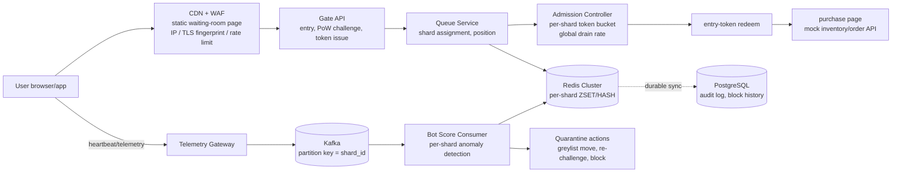
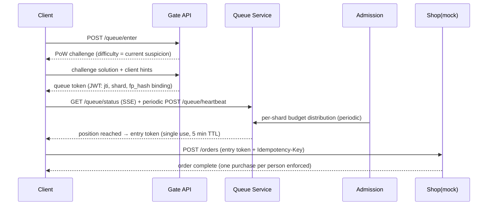

# ShardGate — Design: a sharded virtual waiting room with automatic bot mitigation

***English** · [한국어](DESIGN.ko.md) — the Korean document is the original; this is a translation.*

> Design document for a system that, during events where hundreds of thousands to millions
> of people arrive within seconds (concert ticketing, limited-edition drops), splits users
> into **micro-shard queues** and **uses each shard as a statistical sample population to
> automatically detect, isolate, and block bots**.
> It is a portfolio project, but it is designed on the assumption of real high-traffic
> conditions.

---

## 1. Problem and goals

### 1.1 The problem
- At the moment tickets open, traffic spikes hundreds to thousands of times above baseline.
  If the origin (inventory / payment) is exposed directly, it goes down immediately.
- Bots enter faster and retry harder than people, taking opportunities from real users.
- The conventional answer — a *single global queue* — has two limits: (a) a Redis hot-key
  bottleneck, and (b) bot detection that has to compute over the entire population.

### 1.2 The answer to the central question
**"Can we split people into small groups and block bots inside each group?" → Yes.**
In fact, splitting *helps* bot mitigation:

| Aspect | Single queue | Micro-shard queues |
|---|---|---|
| Cost of anomaly detection | Over the whole population (hundreds of thousands) → expensive | Hundreds to thousands per shard → cheap, streamable |
| Detection sensitivity | Bots dissolve into a large population | Bot clusters stand out statistically in a small sample |
| Response to false positives | Requires a global policy change | Re-verify only that shard (minimal blast radius) |
| Infrastructure | One hot ZSET | Keys spread per shard → naturally distributed across Redis Cluster slots |

### 1.3 Goals
1. A virtual waiting room that survives 1M concurrent arrivals.
2. Split users into shards of 500–2,000; manage position and admission rate per shard.
3. Layered bot defense (edge → challenge → token → behavior → shard statistics).
   On detection, **stepwise isolation rather than immediate blocking** (false-positive protection).
4. Implement detection rate / false-positive rate / throughput / latency as *measurable*
   quantities (portfolio evidence).

### 1.4 Non-goals
- Implementing payment, seat selection, or the inventory system itself (mocked).
- "Complete" bot blocking. The goal is to raise the bot's cost above the value it extracts
  from a normal user. (Residential proxies plus a human operating the client cannot be
  stopped by technology alone — see §12.)

  > **Measurement says this sentence is not the right goal for the queue layer
  > (REPORT §3.9).** One successfully admitted bot costs **$0.036**, and PoW is 0.2% of
  > that. Against a $50 ticket premium the gap is 1,400×, and raising PoW to the
  > configured ceiling still only reaches 1.4% of one human-solving-service transaction —
  > the 33 bits that would reach parity is a **265-second** computation for a normal user.
  >
  > What this layer actually does is **reduce the number of successful bots** (observe,
  > isolate, ladder). When one leak was closed, successful bots fell 60.7 → 6.7 — and in
  > that same change the **cost per bot went *down***, because closing the expensive path
  > leaves the cheap one. Raising cost is the job of the account/payment layer (§12-1);
  > this sentence must be read as presupposing that layer.

---

## 2. Architecture



### Components
| Component | Role | State |
|---|---|---|
| CDN + WAF | Static waiting-room page (origin protection), L1 bot filter | none |
| Gate API | Accept entry, PoW challenge, issue signed queue token (JWT) | Redis |
| Queue Service | Shard assignment, position, status lookup (SSE/polling) | Redis |
| Admission Controller | Per-shard admission budget, global admit-rate control | Redis |
| Telemetry Gateway | Collect client heartbeat/behavior events → Kafka | Kafka |
| Bot Score Consumer | Per-shard statistical anomaly detection, scoring, action triggers | Redis + PG |
| Mock Shop | Verify entry token, one purchase per person (idempotent) | PG |

---

## 3. Queue and sharding

### 3.1 Shard assignment must be unpredictable
```
shard_id = HMAC-SHA256(event_salt, queue_token_id) mod N
```
- `event_salt` is regenerated per event and **kept secret until open**, so bots cannot aim
  at a particular shard or precompute assignments.
- `N` = ⌈expected concurrent arrivals / target shard size (default 1,000)⌉. If arrivals
  exceed the estimate, new shards are added dynamically for new arrivals; existing shards
  are never rebalanced (position stability).

### 3.2 Fairness — the FIFO trap
When hundreds of thousands arrive within seconds of opening, pure FIFO favors whoever has
the fastest network — which includes bots. The default is a hybrid:

1. **Lottery window**: anyone entering within the first T minutes (default 2) gets a random
   position within their shard, regardless of arrival order.
2. **FIFO window**: entrants after T are appended in arrival order, behind the lottery band.

Structurally removing the bot's "0.1-second head start" is itself the first line of bot
mitigation.

### 3.3 Redis data structures (distributed per shard)

#### Logical schema
| Key | Type | Contents |
|---|---|---|
| `queue:{event}:{shard}` | ZSET | member = token_id, score = position |
| `hold:{event}:{shard}` | ZSET | Users on admission hold (score 70–89). **Preserves the original position** so release costs them nothing |
| `seq:{event}:{shard}` | STRING | Monotonic position counter for the FIFO window |
| `user:{event}:{token_id}` | HASH | state (waiting\|admitted\|greylist\|held\|blocked\|evicted), shard, score, fp_hash, ip_prefix, joined_at, last_seen, orig_shard, orig_rank |
| `admitted:{event}` | STRING | Cumulative admission counter |
| `budget:{event}:{shard}` | STRING | Remaining admission budget per shard (token bucket) |
| `shards:{event}` | SET | Active shard index; tracks dynamic expansion (§3.1) |
| `entry:{event}:{jti}` | STRING | Single-use entry token. TTL 5 min, burned on redeem |
| `challenge:{event}:{nonce}` | STRING | Single-use PoW challenge, verifiable once within TTL |
| `score:{event}:{shard}` | HASH | token_id → bot score |
| `stats:{event}:{shard}` | HASH | Per-shard statistics (scorer only) |
| `suspicion:{event}:{subject}` | STRING | Suspicion per fp_hash / ip_prefix — input to adaptive PoW difficulty |
| `idem:{event}:{key}` | STRING | Idempotency key |

`queue` / `user` / `admitted` / `budget` are from the original design; the rest were added
during implementation. Do not invent keys outside this table.

#### Physical keys — cluster hash tags
Using the logical keys directly scatters one shard's keys across different hash slots, so
the rule "every state transition is a single atomic Lua execution" **does not hold in
cluster mode** (Lua may only touch keys in one slot). Hence `{event}:{shard}` becomes a
hash tag:

```
queue:{evt1:s0042}          hold:{evt1:s0042}       seq:{evt1:s0042}
budget:{evt1:s0042}         score:{evt1:s0042}      stats:{evt1:s0042}
user:{evt1:s0042}:tok_abc   entry:{evt1:s0042}:jti_xyz
```

- All keys of one shard → same slot → Lua atomicity holds.
- Different shards → different tags → naturally spread across slots, no single hot key.
- Event-global keys are `admitted:{evt1}` and `shards:{evt1}`.
- `challenge` / `idem` put the nonce/key inside the tag (`challenge:{evt1:<nonce>}`) to
  spread them. Only single-key operations are used.

#### The greylist shard shares the origin shard's slot

The greylist move in §4 is three actions: remove from the origin queue, insert into the
greylist queue, change the state. If the two queues live in different slots they cannot be
wrapped in one Lua call under cluster mode, and the move becomes a two-step operation with
a visible intermediate state. So greylist shard `g0042` reuses origin shard `s0042`'s tag
and only appends the shard name:

```
queue:{evt1:s0042}          hold:{evt1:s0042}          ← origin shard
queue:{evt1:s0042}:g0042    hold:{evt1:s0042}:g0042    ← greylist (same slot)
user:{evt1:s0042}:tok_abc                              ← identical in both cases
```

Because the user hash key is identical in both cases, **the user's state never experiences
the move at all.** Only one ZSET member moves, and all of it is inside one slot, so it is
atomic.

Key strings are assembled in exactly one place: `internal/keys`.

- **Every state transition runs atomically as a Lua script** (assign + position, verify +
  budget decrement, …), which eliminates race conditions at the source.
- Distinct shard keys spread naturally across Redis Cluster hash slots, removing the single
  hot key.

### 3.4 Admission control (drain)
- The Admission Controller periodically distributes a global admit rate (e.g. 3,000/min)
  into per-shard budgets.
  - Default: proportional to each shard's remaining population. **Greylist shards get zero
    budget.** The original design said "lower weight", but that only makes sense if there
    is a path to admission directly from greylist. There is no such path in the ladder in
    §4 — the only way out is passing a re-challenge and **returning to the origin shard**,
    and at that moment the user consumes the origin shard's budget. Sending budget to a
    greylist shard makes seats vanish every cycle with nobody able to use them.
- The position shown to a user = position within the shard, plus an estimated wait derived
  from the drain rate. Polled every 5 s, or via SSE.

#### When admission starts — its relationship to the lottery window

The mechanism identified in §12-7 is that detection races admission and loses. The action
pipeline moves on accumulated score, so isolation takes 70–80 seconds, and admissions keep
going out during that time — **a bot that gets in first never gets the chance to be
isolated at all.**

So there is an option to defer the start of admission until the lottery window closes
(`ADMIT_AFTER_LOTTERY`). §3.2 already defines the lottery window as the interval in which
arrival order confers no advantage, so closing admission during it does not change the
fairness of positions. Two things do change:

- Detection gains as much scoring time as the lottery window is long.
- Total waiting time grows by the same amount, and fewer seats go out in the same period.

This is a trade of **throughput against detection rate**, not fairness, so the default is
off. Turning it on requires `EVENT_OPEN_AT` — without it there is no lottery window at all
and the gate silently becomes a no-op, so config validation refuses to start.
Measurements: docs/REPORT.md §3.4.

#### Per-user minimum observation gate — `ADMIT_MIN_DWELL` / `ADMIT_MIN_BEATS`

The gate above **blocks everyone using one event timestamp**, which leaves two problems.
Seats in a blocked cycle simply vanish (no budget is distributed), and anyone arriving
after the gate opens passes with almost no observation. What needs observing is not the
event but the **individual**, so the measurement must start from the individual's own
entry.

```
admit if  (rank < budget) AND (now - observe_from ≥ MIN_DWELL) AND (hb_count - hb_base ≥ MIN_BEATS)
```

The reference point is not entry time but the **observation clock** (`observe_from`). The
two are usually identical, but they diverge after a re-challenge return — see
"A return rewinds the observation clock" below.

"Not yet observed enough" is not innocence; it is **inability to judge**. Passing because
the score is low and passing because there is not yet a basis for a score are different
things, and admitting the latter means the action pipeline (invariant 3) exists but reaches
nobody.

The check sits **before the budget decrement (DECR)** in `admit.lua`. Placed after it, a
user still under observation burns a seat that nobody can use. Placed before it, the budget
survives into the next cycle — this gate **defers seats rather than destroying them.**
That is the practical difference from `ADMIT_AFTER_LOTTERY`.

The value is not a matter of taste; it comes from measurement: the **P90 time-to-detection
for isolation** (202.3 ± 11.7 s in REPORT §3.5). Shorter than that and you release bots
whose score has not risen yet; longer and you only make people wait. `MIN_BEATS` is paired
with the scorer's `SCORE_MIN_SAMPLES` — set below it and the gate opens before the scorer
has even begun to judge.

`MIN_BEATS` can be forged (just send more often), but doing so fills `MinSamples` faster
and makes the interval regularity sharper — a losing trade for a bot. The enforcement lives
in `MIN_DWELL`, which the server records; `MIN_BEATS` is a floor on "did the data to be
observed actually arrive".

Both default to 0 (off). They increase waiting time, so enabling them is an operational
decision.

#### A return rewinds the observation clock

A gate that measures entry time **only protects the first admission.** A user who returns
via re-challenge (§4) comes back having already satisfied the condition, so the race of
§12-7 restarts once per return — while the score climbs back from the clamp (35) to the
threshold, the returned participant hammers redeem from the front of the queue with no
observation at all.

So `rechallenge.lua` stamps `observe_from` / `hb_base` to *now* on return, and `admit.lua`
measures from those. **It is the same principle — buy the detector time — reapplied exactly
at the leak**, and the cost falls only on users who have been flagged at least once.

- `joined_at` is not overwritten. Entry time is the basis for auditing and for lottery-window
  decisions; after a return it and the observation origin are **two different facts**.
- The UI must read the same clock (`Snapshot.ObservedFrom`). If it does not, the estimated
  wait is short only for returned users — and the side where screen and server disagree is
  always the user who has already been flagged once.
- **The door that opens by the score falling on its own (`restore_shard.lua`) does not
  rewind.** The clamp is a concession, not a verdict, so it needs observation to re-establish
  the true value; a score decline is a conclusion the detector reached across many windows.

This adds a second criterion for gate length. Beyond §3.6's "longer than the isolation
median", **`MIN_DWELL` must be longer than the time it takes a returned participant to reach
the threshold again.** That time is far shorter than the initial isolation, because the score
starts at 35 rather than 0. Measurement and results: REPORT §3.8.

**Measured (REPORT §3.6): `MIN_DWELL=200s` beats `ADMIT_AFTER_LOTTERY` on four axes at
once** — detection 96.2 vs 91.7, bot admission 3.9 vs 8.3, human admission 51.4 vs 37.5,
seats released 371.2 vs 287.5 (not one of the 95% intervals overlaps). The only cost is that
the first admission comes 30.4 s later, and the false-positive rate was 0.0% in all 16 runs.

**Gate length is chosen by comparison with the isolation median.** The same 90 seconds, if
shorter than the isolation median (132–142 s), opens the door before the verdict lands and
detection stops at 85.4%. Setting it to 200 s, above the median, yields 96.2% — buying
observation time and having that observation reflected in the admission decision are
different things, and the latter requires the gate to outlast the verdict.

### 3.5 Entry-to-purchase sequence


---

## 4. Automatic bot mitigation — layered defense

Any single technique will be broken. Each layer independently raises the bot's cost, and the
final judgment is made on an accumulated score.

### L1. Edge (CDN/WAF)
- IP/ASN reputation, per-IP rate limiting, penalties for datacenter IP ranges.
- Protocol-level fingerprints — TLS (JA3/JA4), HTTP/2 frame ordering — which identify
  curl / python-requests style clients immediately.

### L2. Entry challenge (adaptive PoW + CAPTCHA fallback)
- The browser must solve a hash puzzle (PoW) before a token is issued. ~0.2–1 s once for a
  normal user; ~10,000× that for a 10,000-account bot farm.
- **Adaptive difficulty**: when suspicion rises from L1/L5, difficulty for that user/shard
  rises exponentially.
- A CAPTCHA path (e.g. Cloudflare Turnstile) for low-end devices that cannot solve PoW.

### L3. Token design (theft, sharing, reuse)
- Queue token = signed JWT: `jti` (single use), `shard_id`, device fingerprint hash, IP
  prefix claim.
- Reuse from a different fingerprint/network → immediate invalidation plus a score penalty.
  Entry tokens are single-use, 5 min TTL, and burned on redeem.

### L4. Behavioral telemetry (client)
- Regularity of heartbeat intervals: macros are too precise (variance ≈ 0), humans jitter.
- Pointer/touch event entropy, naturalness of page event ordering.
- Telemetry is a signal only, never grounds for blocking on its own (forgeable, and it
  produces accessibility false positives).

### L5. Per-shard statistical anomaly detection — the core of this design
A shard (≈1,000 people) is used as the sample population. A Kafka consumer (partition key =
shard_id) stream-processes while holding only per-shard state. The small population makes it
cheap, and bot clusters stand out statistically.

| Signal | Bot characteristic | Detection method |
|---|---|---|
| heartbeat inter-arrival | Abnormally low variance | z-score against the shard distribution |
| request timing cross-correlation | Farms move in sync | Clustering of timing correlation within the shard |
| fingerprint duplication | Same/similar fingerprint across accounts | fp_hash group count within the shard |
| IP prefix concentration | Many tokens in one /24 | Prefix histogram within the shard |
| PoW solve time | GPU farms are consistently fast | Outliers in the solve-time distribution |

#### Attack scenario: baseline pollution

Three of the signals above (the heartbeat relative term, cross-correlation, PoW) are
**comparisons against the shard distribution**. Since the comparison baseline is derived
from that shard's sample, **an attacker who supplies part of the sample can move the
baseline itself.** Push in many accounts in the same behavior band as your bots and that
band stops being unusual, lowering your bots' relative score.

Measured (REPORT §3.12): in a shard of 350 normal users and 50 target bots, flooding it with
accounts in the same band drives the target's regularity signal monotonically from
**0.780 → 0.320** (12% → 50% contamination). Multiplied by its weight that is 11.5 points —
enough to undo an entire rung of the ladder.

The defense has three layers, **and they have an order**:

1. **The absolute floor (`HEARTBEAT_CV_FLOOR`) is the first line.** Regularity no human hand
   can produce is a signal regardless of the neighborhood, so while this term is alive,
   shaking the baseline does not change the value (measured: 0.000 change at observation
   noise 0–50 ms). **Pollution only works once this term is dead** — and what kills it is
   server-side observation noise. `IntervalMS` is a server measurement, so **as load rises
   the detector opens up to pollution** (−0.070 at 100 ms noise). Keeping latency low is
   part of detection accuracy.
2. **The unpredictability of shard assignment (§3.1) is the second line.** To raise the
   contaminated fraction of a shard, an attacker must be able to concentrate accounts there —
   which is impossible while `event_salt` is secret. This property is what bounds the
   contamination ratio.
3. **Robust estimation (`SCORE_ROBUST_BASELINE`) is auxiliary and not unconditionally
   better.** Median/MAD is clearly better up to 36% contamination (0.616 vs 0.420) but
   **worse past 50%** (0.176 vs 0.320) — that is MAD's breakdown point, and beyond it the
   center flips wholesale to the attacker's cluster. The mean is pushed gradually; the median
   holds and then falls off a cliff. Default off (it changes detection logic, so the default
   may only change after a load measurement).

The fingerprint and IP-prefix signals are not exposed to this attack. Those two divide the
**count of tokens sharing a value** by a fixed cap rather than comparing to a distribution,
so there is no baseline to move. Keep this property in view when adding relative signals —
if no signal has an absolute reference, the limitation in §12-6 becomes the attacker's
option.

### Action pipeline — never block immediately (false-positive protection)
```
score 0–39   : observe only
score 40–69  : move to greylist shard → raised PoW difficulty + re-challenge
               on pass, return to the origin shard and original position
               (normal users lose no place in line)
score 70–89  : admission hold (stays queued, excluded from admission) + strong re-verification
score 90–100 : token invalidation + block, with evidence logged to PG
```
- What the greylist "shard move" actually does is **separate admission throughput**. The
  suspected group no longer occupies the normal shard's queue or budget, so normal users'
  admission speed is not contaminated.
- If a farm is concentrated in one shard, only that shard is frozen and re-challenged in
  full — other shards are unaffected.

#### Scoring continues regardless of action

Being moved to greylist or hold does not stop observation or score updates. What changes
with state is **the kind of action**, not whether observation happens. If it stopped,
isolation would become a terminus, the four rungs of the ladder would lose their meaning,
and a participant who keeps behaving like a bot would freeze just above the threshold
(which is exactly what happened — REPORT §3.5, 2,400 bots frozen at 40.2).

Therefore **the scoring population is always the origin shard.** Even after a move to
greylist, telemetry flows under the origin shard key and the scorer keeps comparing that
person against the origin shard population. Scoring the suspected group by itself would
reproduce the paradox of §12-6 — everyone nearby is also suspect, so relative signals
converge to 0 and the score goes back down. **The reference population for relative signals
must be the general population.** What greylist separates is the queue and the budget, not
the statistical sample.

#### Re-challenge — the only way out of greylist

The reason 40–69 has its own rung is that it is a **reversible checkpoint**. Without a way
out, 40–69 and 70–89 become the same thing and "false-positive protection" is empty — a real
person who crossed 40 and is permanently excluded without a chance to re-verify experiences
one thing: a long wait ending in rejection. A low false-positive rate means this is rare, not
that it is impossible (§12-5).

```
POST /api/v1/challenge/reissue    requires queue token. Issues a raised-difficulty challenge (stateless)
POST /api/v1/challenge/reverify   verifies the solution → return to origin shard and position
```

Redeem returns **200 + `challenge_required`** to a greylist user. The reason it is not 409 is
the same as for `observing` (§3.4) — a state that is pre-verdict or reversible is not an
error, and returning 409 hides the very fact that a re-verification path exists.

Three constraints keep the door from becoming a cheap exit:

1. **The score is not reset to 0.** It is only clamped to just below the threshold
   (`RECHALLENGE_PASS_SCORE`, default 35). A bot that outsourced only the puzzle must climb
   again on behavioral signals right after returning; starting from 0 would need twenty more
   windows because of the exponential smoothing, which is effectively an exemption.
   Conversely, leaving the score untouched would re-isolate it in the next window, making the
   pass meaningless. It is a clamp, not an assignment — it never raises a lower score.
2. **Difficulty rises with each attempt.** The **maximum** of suspicion (fingerprint, IP
   range) and re-verification count (token) is used. Adding them makes one
   isolation→re-verification cycle raise both at once, counting the same event twice; in
   practice the ceiling was reached within two attempts and nobody could pass. The attempt
   count is kept because its scope is different — suspicion can be blurred by rotating
   fingerprint and IP range, but the count is that token's history and cannot be scrubbed.
   The count is a floor; suspicion is a per-subject estimate.
3. **An attempt cap (`RECHALLENGE_MAX_ATTEMPTS`, default 2).** Coming back again past the cap
   does not return the user; it promotes them to hold (70–89) — repeatedly getting caught and
   repeatedly solving is itself a signal. Hold also preserves position, so this promotion is
   reversible too.

The path that opens by itself when the score decays (`restore_shard.lua`) remains. A
re-challenge is a door **the user actively opens**; that one is a door **that opens when the
score comes down on its own**.

#### Passing the door does not get you admitted — and time cannot fix it

In measurement the door is closed to **both sides**. A bot's re-verified return does not lead
to admission (REPORT §3.8, door channel = 0), and neither does a falsely-flagged human's
(§3.10, human door channel = 0; all of them exhausted the cap and were promoted to hold).
The mechanism is single: **crossing the threshold again after a return is faster than
finishing re-observation (`ADMIT_MIN_DWELL`).**

The natural candidate was "make post-return re-observation separate from, and shorter than,
first entry". **It was measured and rejected** (REPORT §3.11). After a return everyone starts
from the clamp (35), so time-to-re-flag is a **monotone transform** of that person's
steady-state score — and that score is higher for the falsely-flagged human (51.7) than for
real bots (46.2 / 37.9). So at any length you choose, the bots' pass rate is greater than or
equal to the falsely-flagged humans'.

Generalized: **an ordering the score already got wrong cannot be corrected by a monotone
function of that same score.** Thresholds, re-observation lengths, and grace periods are all
different names for the same axis. To actually make this door open, you must use
**information that is not yet in the score** — that is, account for the re-verification pass
itself as evidence, and that is a design change, not a parameter.

### Post-admission defenses
- Purchase API: entry token required + `Idempotency-Key` + one purchase per person by
  account, payment method, and shipping address.

---

## 5. API (summary)

| Method | Path | Description |
|---|---|---|
| POST | `/api/v1/queue/enter` | Entry. Issues a PoW challenge |
| POST | `/api/v1/challenge/verify` | Verify challenge → issue queue token |
| POST | `/api/v1/challenge/reissue` | (greylist) issue a raised-difficulty re-challenge |
| POST | `/api/v1/challenge/reverify` | (greylist) verify re-challenge → return to origin shard and position |
| GET  | `/api/v1/queue/status` | Position / estimated time (SSE or 5 s polling) |
| POST | `/api/v1/queue/heartbeat` | Liveness signal + telemetry batch |
| POST | `/api/v1/admission/redeem` | Exchange for an entry token when the position is reached |
| POST | `/api/v1/orders` | (mock) purchase. Entry token + idempotency key |
| GET  | `/internal/metrics` | Prometheus metrics |

Three missed heartbeats (~15 s) → soft-evict from the queue (removed after a 30 s grace).

---

## 6. Data model (PostgreSQL — durable / audit)

```sql
events(id, name, open_at, salt_hash, shard_size, admit_rate_per_min, lottery_window_sec)
queue_audit(id, event_id, token_id, shard_id, action, score, reason_json, created_at)
blocks(id, event_id, token_id, fp_hash, score, evidence_json, created_at)
orders(id, event_id, token_id, account_id, idempotency_key UNIQUE, created_at)
```
Redis is the single source of truth on the hot path; PG preserves audit, analysis, and
blocking evidence (written asynchronously).

---

## 7. Scalability and failure design

- **Origin protection**: the waiting-room UI is served statically from the CDN. Even if the
  entire backend dies, users keep seeing the waiting screen.
- **Redis Cluster**: shard keys spread evenly across slots. Queue state is treated as
  disposable data that can be discarded after the event, so a failure scenario of "reset the
  queue and re-run the lottery" is documented as an explicit operational procedure.
- **Kafka**: partition key = shard_id, so the same shard's events go to the same consumer.
  Consumer lag delays only detection, never the queue (detection and admission paths are
  decoupled).
- **Backpressure**: admit rate slows automatically based on downstream (mock shop) health,
  with a circuit breaker.
- **Idempotency**: every state-changing API is retry-safe (idempotency key or atomic Lua).

## 8. Stack (stable versions as of 2026-08)

| Area | Choice | Notes |
|---|---|---|
| Language | Go (latest stable) | Goroutines suit high-concurrency heartbeat/SSE. Node/TS would also work |
| Cache / queue state | Redis 8.x (open source, cluster mode) | ZSET + Lua |
| Event stream | Apache Kafka 4.2.x (KRaft) | Single broker in docker locally |
| Durable DB | PostgreSQL (latest stable major) | Audit / blocks / orders |
| Load testing | k6 | Includes the bot simulator |
| Observability | Prometheus + Grafana | Detection-rate / FPR dashboard |
| Deployment (demo) | docker compose | k8s manifests are optional work |

## 9. Repository layout

```
shardgate/
├── CLAUDE.md
├── docs/DESIGN.md            # this document
├── cmd/{gate,queue,admission,scorer,shop}/     # per-service main
├── internal/
│   ├── shard/        # assignment (HMAC), dynamic growth
│   ├── queue/        # ZSET operations, Lua loader
│   ├── challenge/    # PoW, CAPTCHA adapter
│   ├── token/        # JWT issue/verify/binding
│   ├── telemetry/    # event schema, Kafka producer
│   ├── botscore/     # shard statistics, scoring, actions
│   └── admission/    # token bucket, drain distribution
├── scripts/lua/      # enqueue.lua, admit.lua, move_shard.lua ...
├── deploy/docker-compose.yml
├── loadtest/k6/      # normal_users.js, bot_farm.js, mixed.js
└── web/              # waiting-room demo page (static)
```

## 10. Implementation roadmap (one Claude Code session per phase)

| Phase | Content | Done when |
|---|---|---|
| 0 | Scaffolding, docker compose (Redis/Kafka/PG), CI | `make dev` brings everything up |
| 1 | Queue core: shard assignment + Lua enqueue/position | Unit tests + 100k enqueue benchmark |
| 2 | Admission: per-shard budget, redeem, SSE status | E2E: entry → admission happy path |
| 3 | Challenge: PoW (adaptive difficulty) + token binding | Token-reuse attack tests pass |
| 4 | Telemetry → Kafka → shard scorer + action pipeline | Bot simulator detection confirmed |
| 5 | Large k6 scenarios + Grafana dashboard + demo UI | §11 metrics report produced |

## 11. Validation plan — the portfolio's evidence

Using the k6 mixed scenario (N×10k normal users + M×1k bot farm; bot types: naive script /
heartbeat mimic / distributed IP), measure and report:

- **Detection rate (recall)**: blocked or isolated bots / all bots
- **False-positive rate (FPR)**: isolated normal users / all normal users (distinguishing
  whether greylist returns count)
- **Admission throughput and P99 entry latency**, Redis/Kafka resource usage
- Whether normal users' admission success rate holds as the bot ratio rises (the key graph)

## 12. Limits and trade-offs (documented honestly)

1. Residential proxy + real device + human operator is indistinguishable to this system —
   account/payment-level policy (identity verification, purchase history) is required.
2. Fingerprinting is subject to privacy regulation (GDPR etc.) — store hashes only, destroy
   after the event.
3. PoW penalizes low-end devices — mitigated by adaptive difficulty plus the CAPTCHA path.
4. The lottery window conflicts with the intuition that "earlier should be better" —
   announcing the fairness model transparently is a prerequisite.
5. Telemetry signals are forgeable — hence no blocking on a single signal; accumulated score
   plus soft actions is the rule.
6. **Relative signals require a population to compare against** (confirmed in Phase 4
   measurement). The signals in §4-L5 ask "is this user unusual compared to others in their
   shard". Consequently (a) a bot that forges human-like timing erases the regularity and
   cross-correlation signals, and the remaining fingerprint (0.25) and IP-range (0.15)
   weights sum to exactly the greylist line (40); (b) **scoring the greylist shard as a
   separate population** makes everyone nearby suspect, so relative signals converge to 0 and
   the score comes back down — the paradox where isolation makes re-observation harder.
   Lowering the threshold only adds false positives; it does not close this gap. From here on
   it is the domain of account/payment policy, as in item 1.

   (b) **was avoided by design decision**: the scoring population is always the origin shard
   (§4). What greylist separates is the queue and the budget, not the statistical sample. The
   reason is that the reference for relative signals must be the general population — and the
   price is that §4's original idea of "herd the suspects into a separate population for
   closer observation" is not implemented; the original idea and (b) cannot both be true.
7. **Detection races admission, and often loses** (confirmed in Phase 5 measurement).
   The action pipeline moves on accumulated score (§4, invariant 3), so isolation takes time —
   tens of seconds to fill `MinSamples`, then tens more for the score to cross the greylist
   line. Admissions keep going out during that window, and **a bot that has already been
   admitted never gets the chance to be isolated** (an admitted client stops sending
   heartbeats, so the scorer has nothing left to see). In measurement the isolation median
   lagged the bot admission median by 30–77 s, and bot admissions always landed on "all bots
   minus isolated bots". In other words, **what caps the detection rate is not detection
   accuracy but admission speed.** Lowering the threshold is not the answer — the score has
   not risen *yet*, it has not risen *wrongly*, so you gain false positives rather than
   recovering misses. The place to look is the relationship between the lottery window (§3.2)
   and the start of admission (§3.4). Numbers and discussion: docs/REPORT.md §3.3.

   **A follow-up measurement (REPORT §3.4) confirmed that this cap really can be raised.**
   Simply enabling the lottery window raises detection by 13pp and lowers bot admission by
   13pp with no loss in seats or in human admission rate — because bots can no longer claim
   the front. Deferring admission to the end of the lottery window gains another 13pp, but
   that one buys it by cutting the seats released by 38%, which is a different character
   (§3.4). Thresholds were not touched in either case, and the false-positive rate stayed 0%.

   **The size of the cap was measured too (REPORT §3.5).** With admission off and the race
   removed entirely, detection is 100.0 ± 0.0% at 0.0% FPR (1,000 users × 8 runs). That is,
   the 53.8% in §3.1 was not a limit of the detector — **it was all lost in the race.** Time
   to isolation is a median of 139.8 s and a P90 of 202.3 s, and that P90 becomes the basis
   for the per-user observation gate (§3.4).

8. **Greylist was a terminus with no exit — fixed** (surfaced in REPORT §3.5, Phase 8).
   The defect had three layers. The `noop` path in `move_shard.lua` sat **before the score
   write**, so not one post-isolation verdict was ever stored (2,400 bots all frozen at 40.2);
   there was no re-challenge path at all; and `apply_action.lua` did not know about the
   greylist queue, so hold and block left members in that ZSET. Together, 40–69 had become a
   *heavier* action than 70–89 — hold preserves position and is recoverable, while greylist
   had even the path for the score to come down blocked.

   The fix went in the direction of **making the implementation match the document** (§4
   re-challenge). The opposite direction — documenting current behavior as "greylist =
   permanent exclusion" — removes the reason for the ladder to have two rungs and, above all,
   permanently excludes falsely-flagged people with no re-verification. An FPR of 0% is an
   artifact of simulation thresholds, not proof that false positives are impossible (item 5).

   Remaining limit: **the implemented re-challenge is PoW only.** PoW is not an impassable
   wall for a bot but a CPU cost, so this door does not stop bots — it **makes them more
   expensive**. In practice a farm shares fingerprints, so suspicion rises together and cost
   jumps by 2^bump per attempt, quickly reaching `POW_MAX_DIFFICULTY`. But it can be passed
   by spending more compute, and the CAPTCHA path in §4-L2 (Turnstile etc.) exists only as an
   adapter slot. Incidentally this cost is **also paid by falsely-flagged people** — their
   suspicion is 0 so they only pay the attempt-count share (default +4 bits), but on a low-end
   device even that is not light.

   **The size of the leak was measured (REPORT §3.7).** With difficulty escalation disabled so
   that only the door axis remains, bot admission rises 3.7 → 12.6 → 20.2% as the bots'
   re-verification pass rate goes 0 / 50 / 100%. **Detection overlaps at 96–97% in all
   three** — isolation is recorded at the moment of first observation, so leaving through the
   door is not a detection failure, and therefore a recall-only table cannot see this leak.
   Total seats released is the same across the three arms, so the seats bots took are exactly
   the seats humans lost (51.3 → 44.2%). Note also that the attempt cap had already filtered
   part of it — in door10, 187 of 720 attempts exhausted the cap and were promoted to hold.

   **Most of that 20.2% was not the door itself but the door bypassing the observation gate
   (REPORT §3.8).** The gate measured entry time, so returning participants came back already
   satisfying it, and the race of §12-7 restarted every time the door opened. Rewinding the
   observation clock to the return moment (§3.4) drove **bots entering through the door to 0**
   (in all three runs) and bot admission down to 2.2%. The remaining 2.2% is not the door but
   the race of participants who were never flagged at all. Seats going to humans rose from 309
   to 331.

   This defect also failed to move the detection rate at all, so it passed §3.7's table
   unchanged — the property that paragraph identified ("a recall-only table cannot see the
   leak") applied to that very measurement. So a per-channel admission identity was added to
   the measurement harness.

   **The cost was measured too (REPORT §3.9).** Even raised to the configured ceiling (26
   bits), PoW is 1.4% of one human-solving-service transaction; reaching parity would need 33
   bits, which is a 265-second computation for a normal user. So **PoW is not a substitute for
   the solving service but a floor**, and the practical width of "makes them more expensive"
   above is one one-thousandth of four cents. §1.4's "bot cost > normal user's value" is not
   achieved at this layer (a 1,400× gap); the layer that achieves it is the account/payment
   policy of item 1.
